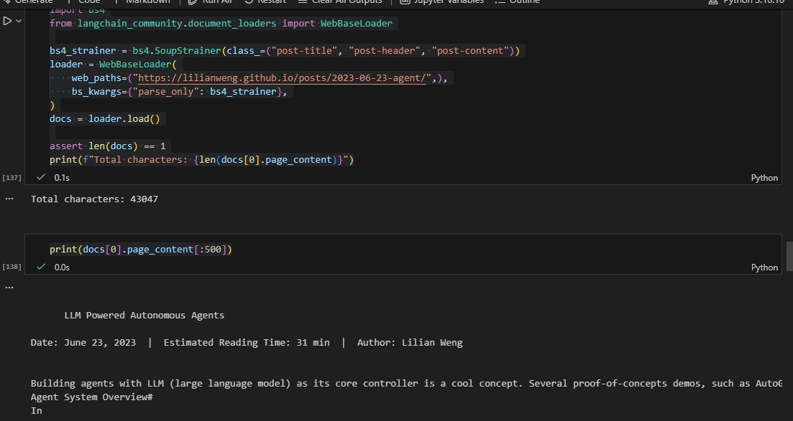
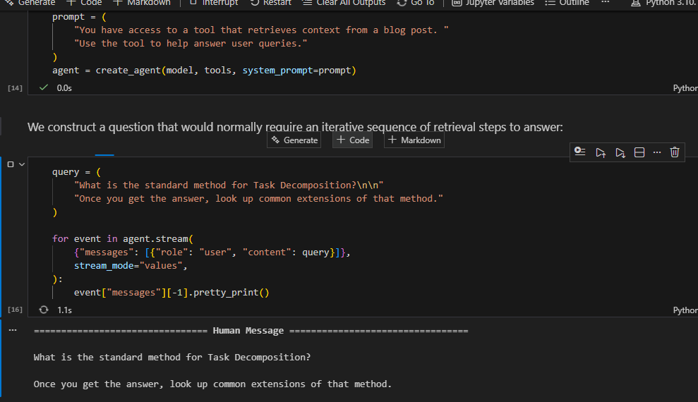

# RAG-agent-with-LangChain

This repository contains a single Jupyter Notebook RAG-agent-with-LangChain.ipynb that implements a **Retrieval-Augmented Generator (RAG)** using **LangChain**, **Pinecone** as the vector database, and **OpenAI-compatible models** for both embeddings and chat completion. The notebook ingests a public blog post, splits it into chunks, stores embeddings in Pinecone, and then answers questions by retrieving the most relevant chunks and using them as context for the LLM.

## Architecture and Components

- **Data Source**: A web page loaded via WebBaseLoader Lilian Weng’s post about agents
- **Chunking**: RecursiveCharacterTextSplitter with chunk size 1000, overlap 200
- **Embeddings**: OpenAIEmbeddings(model=text-embedding-3-large) dimension 3072
- **Vector DB**: **Pinecone** serverless index, cosine similarity
- **Retriever**: vector_store.similarity_search(query, k=2)
- **RAG Agent**:
  - A LangChain **tool** retrieves relevant chunks
  - An **agent** uses the tool to answer user questions with retrieved context

---

## Getting Started

These instructions will get you a copy of the project up and running on your local machine for development and testing purposes. 

### Prerequisites

What things you need to install the software and how to install them

- **Python 3.10+** 
- **pip**
- **Git**
- **Jupyter** - VS Code notebooks or Jupyter Lab/Notebook
- **Pinecone account with API key**
- **OpenAI-compatible API key**
  - The notebook reads GITHUB_TOKEN from .env and uses an OpenAI-compatible base URL:
    - openai_api_base="https://models.inference.ai.azure.com"
  - If you use OpenAI directly, you can swap to OPENAI_API_KEY and remove/adjust the base URL.

Check Python:
```bash
python --version
```

Install Jupyter:

```bash
pip install -U jupyter
```

### Installing

A step by step series of examples that tell you how to get a development env running

Say what the step will be

1. **Clone the repository**

```bash
git clone https://github.com/daviidc29/RAG-agent-with-LangChain
cd RAG-agent-with-LangChain
```

2. **Create and activate a virtual environment**

```bash
python -m venv .venv
```

* Windows (PowerShell):

```bash
.\.venv\Scripts\Activate.ps1
```

* macOS/Linux:

```bash
source .venv/bin/activate
```

3. **Install dependencies**

Install the packages used in the notebook:

```bash
pip install -U \
  langchain \
  langchain-openai \
  langchain-community \
  langchain-text-splitters \
  langchain-pinecone \
  pinecone \
  python-dotenv \
  beautifulsoup4
```

4. **Create a .env file**
   And repeat

Create a file named .env in the repository root:

```env
# OpenAI
GITHUB_TOKEN=YOUR_OPENAI_COMPATIBLE_KEY_HERE

# Pinecone
PINECONE_API_KEY=YOUR_PINECONE_API_KEY_HERE

# Optional (only if you want LangSmith tracing)
LANGCHAIN_TRACING_V2=true
LANGCHAIN_API_KEY=YOUR_LANGSMITH_API_KEY_HERE
```

**If you prefer OpenAI directly**

* Replace GITHUB_TOKEN with OPENAI_API_KEY in the notebook and .env
* Remove/adjust openai_api_base="https://models.inference.ai.azure.com"

Example:

```env
OPENAI_API_KEY=YOUR_OPENAI_KEY_HERE
PINECONE_API_KEY=YOUR_PINECONE_API_KEY_HERE
```

5. **Run the notebook**
   until finished

Option A (VS Code):

* Open RAG-agent-with-LangChain.ipynb
* Select the .venv kernel
* Run cells **top-to-bottom**

Option B (Jupyter Lab):

```bash
jupyter lab
```

Open RAG-agent-with-LangChain.ipynb and run all cells.



Example query already included in the notebook:

* **User question**:

  * “What is the standard method for Task Decomposition? Once you get the answer, look up common extensions of that method.”

Expected behavior (high level):

* The agent calls retrieve_context(query)
* The tool retrieves the top-2 similar chunks from Pinecone
* The agent answers using the retrieved text as context



---

## Running the tests


There are **no automated tests included** because this is a notebook-based lab. Validation is done by running the notebook and verifying that:

* Documents are loaded and split successfully
* The Pinecone index exists (or gets created)
* Documents are embedded and upserted
* Retrieval returns relevant chunks
* The agent produces an answer without errors


**Manual end-to-end check**:

* Confirms your API keys are loaded from .env
* Confirms embedding generation works
* Confirms Pinecone index and similarity search works
* Confirms the agent can call the retrieval tool and answer with context

* Run all cells
* Confirm you see:

  * a Split blog post into X sub-documents message
  * printed document_ids
  * agent streaming output with tool usage and a final answer

### And coding style tests


No linting/formatting tools are configured by default. If you want to add them, a common setup is ruff and black


```bash
pip install -U ruff black
ruff check .
black .
```

---

## Deployment

Add additional notes about how to deploy this on a live system

This repository is designed for a **local workshop / lab** execution in a notebook. For a “live” deployment, a typical path is:

* Extract notebook logic into Python modules (src/ingest.py, src/agent.py)
* Create an API (FastAPI) with an endpoint like /ask
* Run with Docker and deploy to a cloud platform (AWS / Azure / Render / etc.)
* Store secrets using environment variables in your deployment platform

---

## Built With

* **Python** - Programming language
* **LangChain** - RAG orchestration + agent tooling
* **langchain-openai** - OpenAI-compatible chat + embeddings
* **Pinecone** - Vector database
* **langchain-pinecone** - Pinecone vector store integration
* **BeautifulSoup4** - HTML parsing for web loading
* **python-dotenv** - Environment variable management
* **Jupyter Notebook** - Execution environment

---

## Contributing

Please read CONTRIBUTING.md for details on our code of conduct, and the process for submitting pull requests to us.

(If `CONTRIBUTING.md` is not present yet, you can contribute by opening an issue describing the change, then submitting a PR.)

---

## Authors

David Santiago Castro - Initial work

---

## License

This project is licensed under the MIT License - see the LICENSE.md file for details

---

## Acknowledgments

* LangChain RAG tutorial and Quickstart material
* Pinecone with LangChain integration examples
* Lilian Weng’s public blog post used as a sample knowledge source
* Hat tip to anyone whose code was used
* Inspiration
  etc


